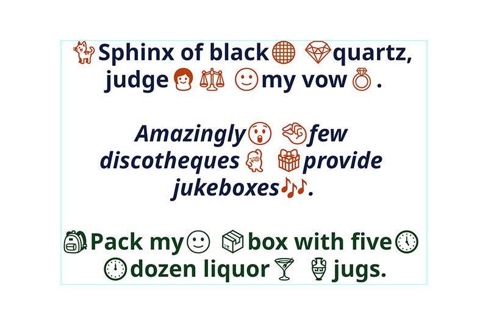

# text-layout

Wrap styled runs of text to a given width

Fit styled runs of text to a given size, eg scale the text uniformly and re-wrap 
until it fits

It uses a binary search and a best guess initial scale heuristic for fitting, so
it's pretty fast

Has some other fit strategies - contain and solid - to be documented

Although functionally complete for my use case, there is still a lot to do to 
make it palatable for others to use - see the todo section below

It's dumb and has no external dependencies, eg it only knows how to wrap and fit 
text, and not anything about fonts, you need to bring your own code to measure 
text (you can use eg a canvas context and getMetrics, or even roll your own from 
the font metrics using eg opentype or a similar font parser)

It also has some helpers for doing things like drawing the layout, again you 
need to provide a user defined bridge function to whatever drawing library you 
are using

## example output

Wrapped, fitted, centered:



## install

`npm install @nrkn/text-layout`

## example

With a browser canvas (or node library with compatible API)

```ts
import { 
  DrawRun, MeasureRunWidth, TextRun, drawBlock, fitter, hardWrapper, softWrapper 
} from '@nrkn/text-layout'

// omitted, set up canvas, get context, ensure fonts loaded etc

// byo functions
const runToCssFontString = (run: TextRun) =>
  `${run.fontSize}px ${run.fontFamily}`

const measure: MeasureRunWidth = run => {
  ctx.font = runToCssFontString(run)

  return ctx.measureText(run.text).width
}

const drawRun: DrawRun = (run, x, y) => {
  ctx.font = runToCssFontString(run)
  ctx.fillStyle = run.color || 'black'
  ctx.fillText(run.text, x, y)
}

// create some runs
const runs: TextRun[] = [  
  {
    text: "🐈",
    fontFamily: "NotoEmoji",
    fontSize: 80,
    lineHeight: 1.2,
    color: "#b7410e"
  },
  {
    text: "Sphinx of black",
    fontFamily: "NotoBold",
    fontSize: 80,
    lineHeight: 1.2,
    color: "#0e1f41"
  },
  // etc
]

const wrapHard = hardWrapper( measure )

// generate a layout respecting any newlines in the runs provided
const hardWrapped = wrapHard( runs )

// wrap at eg 800 pixels
const wrapSoft = softWrapper( 800 )

const softWrapped = wrapSoft( hardWrapped )

const blockDraw = drawBlock( drawRun )

// draw the layout at x: 50, y: 50
blockDraw( softWrapped, 50, 50 )

// or fit the layout to a given size
const fitBlock = fitter({ width: 800, height: 600 })

const fitResult = fitBlock( hardWrapped )

// draw the layout at x: 50, y: 50

blockDraw( fitResult.wrapped, 50, 50 )
```

Note that it draws the layout so that the baseline of the first line sits on y,
like HTML canvas does by default

You can measure the ascent and offset it to start drawing *below* y like so:

```ts
import { 
  MeasureRunAscent, lineAscent
} from '@nrkn/text-layout'

// omit generating a block etc, see example above

const measureAscent: MeasureRunAscent = run => {
  ctx.font = runToCssFontString(run)

  return ctx.measureText(run.text).actualBoundingBoxAscent
}

const getAscent = lineAscent(measureAscent)

let x = 50
let y = 50

// allow for the difference in ascent between the first line and the rest so 
// that the text is drawn *below* the given y, rather than using y as 
// the baseline
if (block.lines.length) {
  y += getAscent(block.lines[0])
}

// now draw as before
```

## todo

### add a section about motivation etc

Could not find a small, simple text layout library that could handle mixed runs 
of text, eg some words or even letters within words could have different font 
families, sizes etc, any solutions that came close were either too heavy or too 
tied to a specific drawing library

Explain that this was designed for my own use cases, so doesn't cover all
aspects of text layout, explain what it does and does not do, with a note that 
I'm happy to consider adding other use cases and/or accepting PRs to do so

Does not hyphenate, does not handle RTL or vertical text, does not handle 
uncommon white space characters, probably does not handle a lot more things too

### types

Consider using the T extends U pattern, so users can eg decorate their types 
with additional data which is retained when objects are decorated/extended by
our module - maybe not necessary 

Would enable them to eg extend the TextRun type with eg custom styles that don't 
affect layout but can be used by their BYO draw fn

### draw

drawRunAligned should probably be drawLineAligned, makes more sense to do the
whole line at once as only lines are affected by alignment

In that vein, we should probably have a draw for each type, run, word, line etc

### advanced metrics etc

Allow user to pass a more advanced measuring fn

Adjusting the Line width if actualBoundingBoxLeft and actualBoundingBoxRight are 
available - we only need to check the first word and last word on a Line

Adjusting the Block height if actualBoundingBoxAscent and 
actualBoundingBoxDescent are available - we only need to check the first Line
and last Line in a Block

If those metrics are available, consider having an offsetX and offsetY on a 
Block to reflect this, eg so you can draw text flush inside a rectangle, and 
so that the soft wrapper can take them into account

This is particularly important if you need all the text to fit *inside* a 
rectangle with no sticky outy bits, eg by design, italic fonts often fall 
outside the bounds, emoji fonts oftern go above the top bound, etc

### tests

Currently only have integration tests of the "run it and manually look at the 
output images" variety

They're fairly comprehensive but poorly structured, everything in a single file

We should probably have unit test for some of the code, but as it's graphical
in nature integration tests like we currently use are probably more useful
overall

We could even run eg a headless browser, convert the runs to styled spans,
and compare how it wraps etc - but all text layout engines have minor 
differences so it may be difficult and doesn't prove much

#### test more edge cases

Very small or very large text. Very short or very long words. Small amounts or
large amounts of text. Fitting to very small or very large bounds/width etc.

### documentation

Expand the documentation to explain the exposed API 

### examples

Add examples for both node (via @napi-rs/canvas) and browser (via canvas),
and maybe for fun a BMFont based version in a game engine

## license

MIT License

Copyright (c) 2024 Nik Coughlin <nrkn.com@gmail.com>

Permission is hereby granted, free of charge, to any person obtaining a copy
of this software and associated documentation files (the "Software"), to deal
in the Software without restriction, including without limitation the rights
to use, copy, modify, merge, publish, distribute, sublicense, and/or sell
copies of the Software, and to permit persons to whom the Software is
furnished to do so, subject to the following conditions:

The above copyright notice and this permission notice shall be included in all
copies or substantial portions of the Software.

THE SOFTWARE IS PROVIDED "AS IS", WITHOUT WARRANTY OF ANY KIND, EXPRESS OR
IMPLIED, INCLUDING BUT NOT LIMITED TO THE WARRANTIES OF MERCHANTABILITY,
FITNESS FOR A PARTICULAR PURPOSE AND NONINFRINGEMENT. IN NO EVENT SHALL THE
AUTHORS OR COPYRIGHT HOLDERS BE LIABLE FOR ANY CLAIM, DAMAGES OR OTHER
LIABILITY, WHETHER IN AN ACTION OF CONTRACT, TORT OR OTHERWISE, ARISING FROM,
OUT OF OR IN CONNECTION WITH THE SOFTWARE OR THE USE OR OTHER DEALINGS IN THE
SOFTWARE.
